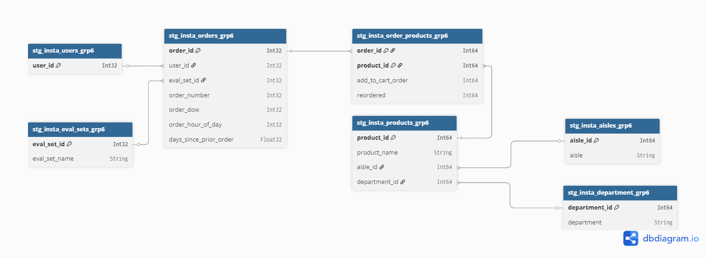

# 📝 Instacart Market Basket Analysis Documentation - Group 6
---

## 1. Project Overview

- **Dataset Used:**  
	*Instacart Market Basket Analysis* 

- **Goal of the Exercise:**  
  *The goal of the exercise is to develop a business question, Apply Normalization → Dimensional Modeling → Data Quality Dashboard using the Instacart Market Basket dataset.*  

- **Team Setup:**  
  - Standard Data Cleaning: *All members*
	- Addy: Departments
	- Aly:   Aisles
	- Angel: Orders
	- Nella: Products
	- Wish: Combination of prior and train
		
  - Data Quality (DQ) Checks:
	- Row Count comparison between raw and clean tables – Wish
	- Referential Integrity check – Wish
		
  - Data Modeling:
	- Create Fact and Dimension Tables based on the business question – Angel

  - Documentation: Aly and Nella 

- **Environment Setup:**  
  *Docker containers on a shared VM + local laptops.*
  - Ingestion: dlt
  - Modeling: dbt
  - Visualization: Metabase
  - Collaboration: Git + GitHub 

---

## 2. Architecture & Workflow

- **Pipeline Flow:**  
  ```
  raw → clean → mart → Metabase
  ```

- **Tools Used:**  
  - Ingestion: `dlt`  
  - Modeling: `dbt`  
  - Visualization: `Metabase`  

- **Medallion Architecture Application:**  

  - **Bronze (Raw):** *Initial ingestion of source data (Skipped)*  
  
  - **Silver (Clean):** 
	- Purpose: To provide a reliable, queryable "single source of truth" for major business entities.
		  
	- Key Activities:
		- Cleaning: We cast the appropriate columns needed and fix data quality issues.
		- Conforming: We standardize data types, apply consistent naming conventions, and ensure conformity across different sources.
		- Enriching: We join tables from different sources to create a more complete view.
		- State of the Data: Validated, cleaned, and organized by business concepts

  - **Gold (Mart):** *We build our star schemas (fact and dimension tables) in this layer.*  

---

## 3. Modeling Process 

## 📂 Folder Structure

```
ftw-de-bootcamp/
└── dbt/
    └── transforms/
        └── instacart_grp6/
            ├── models/
            │   ├── clean/
			│   │   └── stg_insta_aisles_grp6
			│   │   └── stg_insta_department_grp6
			│   │   └── stg_insta_eval_sets_grp6
			│   │   └── stg_insta_order_products_grp6
			│   │   └── stg_insta_orders_grp6
			│   │   └── stg_insta_products_grp6
			│   │   └── stg_insta_users_grp6
			│   │   └── dq_insta_referential_integrity_check_grp6
			│   │   └── dq_insta_row_count_diff_checker_grp6
            │   │   └── schema.yml
            │   └── mart/
            │       └── grp6_insta_dim_aisles
            │       └── grp6_insta_dim_departments
            │       └── grp6_insta_dim_dow
            │       └── grp6_insta_dim_eval_sets
            │       └── grp6_insta_dim_products
            │       └── grp6_insta_dim_users
            │       └── grp6_insta_fact_order_products
            │       └── grp6_insta_fact_orders
            ├── target/              					# dbt docs output (after generation)
            └── ...
```

---

## 🧪 Running dbt Tests

### Clean (structural tests)

* Validate not-null constraints, accepted values, and row count consistency.
* Defined in: `models/clean/schema.yml`

**Run tests:**

```bash
docker compose --profile jobs run --rm \
  -w /workdir/transforms/instacart_grp6 \
  dbt test --profiles-dir . --target local
```

---

⚙️**Source Structure (Normalized):**  
The flow of data from data sources through a series of transformations into a mart schema:
  1. Data Sources:
    
	```
	
	- aisles.csv
    - departments.csv
    - order_products__prior.csv
	- order_products__train.csv
	- orders.csv
	- products.csv
	
	```
	
  2. Raw Schema:
  The raw data from each source is loaded into the raw schema:
	
	```
	
    - raw___insta_aisles
    - raw___insta_departments
    - raw___insta_order_products_prior
	- raw___insta_order_products_train
	- raw___insta_orders
	- raw___insta_products
	
	```
	
  3. Clean Schema:
  After cleaning and preprocessing, the data is transformed into the clean schema:

- stg_insta_aisles_grp6

	
```
{{config(materialized = "table", 
	engine = "MergeTree()", 
	order_by = ["aisle_id"], 
	schema = "clean", 
	tags=["staging", "instacart_grp6"])}}

with insta_aisles as (
select DISTINCT 
  cast(aisle_id as Int64) as aisle_id,
  trim(initcap(lower(cast(aisle as Nullable(String))))) as aisle
 from {{source('raw', 'raw___insta_aisles')}}
 where aisle_id is not null
)
select *
from insta_aisles
```

- stg_insta_department_grp6

```
{{config(materialized = "table", 
	engine = "MergeTree()", 
	order_by = ["department_id"], 
	schema = "clean", 
	tags=["staging", "instacart_grp6"])}}

with insta_department as (
select DISTINCT 
  cast(department_id as Int64) as department_id,
  trim(initcap(lower(cast(department as Nullable(String))))) as department
 from {{source('raw', 'raw___insta_departments')}}
 where department_id is not null
)
select *
from insta_department
order by department
```

- stg_insta_eval_sets_grp6
	
```
{{ config(materialized = "table", schema = "clean", tags = ["staging", "instacartgrp6"]) }}
-- Lookup for evaluation sets (train, prior, test, etc.)
select
  row_number() over () as eval_set_id,
  trim(lower(eval_set)) as eval_set_name
from (
  select distinct eval_set
  from {{ source('raw', 'raw___insta_orders') }}
) as distinct_sets

```

- stg_insta_order_products_grp6
	
```
{{ config(
    materialized = "table",
    engine = "MergeTree()",
    order_by = ["order_id", "product_id"],
    schema = "clean",
    tags = ["staging", "instacart_grp6"]
) }}

with order_products_train as (
    select 
        cast(order_id as Int64) as order_id,
        cast(product_id as Int64) as product_id,
        cast(add_to_cart_order as Int64) as add_to_cart_order,
        cast(reordered as Int64) as reordered
    from {{ source('raw', 'raw___insta_order_products_train') }}
),

order_products_prior as (
    select 
        cast(order_id as Int64) as order_id,
        cast(product_id as Int64) as product_id,
        cast(add_to_cart_order as Int64) as add_to_cart_order,
        cast(reordered as Int64) as reordered
    from {{ source('raw', 'raw___insta_order_products_prior') }}
)

select * from order_products_train
union all
select * from order_products_prior
```

- stg_insta_orders_grp6
	
```
{{ config(materialized = "table", schema = "clean", tags = ["staging", "instacartgrp6"]) }}
-- Clean orders table with FK references to users and eval_sets
select
  cast(o.order_id as int) as order_id,
  cast(o.user_id as int) as user_id,
  cast(e.eval_set_id as int) as eval_set_id,
  cast(o.order_number as int) as order_number,
  cast(o.order_dow as int) as order_dow,
  cast(o.order_hour_of_day as int) as order_hour_of_day,
  -- Handle missing or NaN values properly
  case
    when lower(o.days_since_prior_order) in ('', 'nan') then null
    else cast(o.days_since_prior_order as float)
  end as days_since_prior_order
from {{ source('raw', 'raw___insta_orders') }} as o
join {{ ref('stg_insta_eval_sets_grp6') }} as e
  on trim(lower(o.eval_set)) = e.eval_set_name
```


- stg_insta_products_grp6


```
{{config(materialized = "table", 
	engine = "MergeTree()", 
	order_by = ["product_id"], 
	schema = "clean", 
	tags=["staging", "instacart_grp6"])}}

with insta_products as (
select DISTINCT 
  cast(product_id as Int64) as product_id,
  trim(initcap(lower(cast(product_name as Nullable(String))))) as product_name,
  cast(aisle_id as Int64) as aisle_id,
  cast(department_id as Int64) as department_id
 from {{source('raw', 'raw___insta_products')}}
 where product_id is not null
)
select *
from insta_products
```

- stg_insta_users_grp6


```
{{ config(materialized = "table", schema = "clean", tags = ["staging", "instacartgrp6"]) }}
-- Keep one row per user; clean and cast IDs properly.
select
  cast(user_id as int) as user_id
from {{ source('raw', 'raw___insta_orders') }}
where user_id is not null
group by user_id
```

	
- dq_insta_referential_integrity_check_grp6

	
```
{{ config(
    materialized = "table",
    schema = "clean",
    tags = ["dq_check", "instacart_grp6"]
) }}

--check from child table insta_products is also existing to the parent table insta_aisles table
with dq_aisle_fk as(
    select now() as log_time,
    'insta_products' as table_group,
    'Referential Integrity (aisle_id to aisles)' as dq_test_type,
    count(*) as total_child_records,
    countIf(a.aisle_id is not null) as matched_parent_records,
    countIf(a.aisle_id is null) as unmatched_records
    from {{ ref('stg_insta_products_grp6') }} p 
    left join {{ ref('stg_insta_aisles_grp6') }} a
        on p.aisle_id = a.aisle_id 
),


final as (
    select * from dq_aisle_fk
)

select 
    log_time,
    table_group,
    dq_test_type,
    total_child_records,
    matched_parent_records,
    unmatched_records,
    round((unmatched_records * 100.0 / total_child_records),2) as percentage_of_unmatched,
    case when unmatched_records = 0 then 'PASS'
        else 'FAIL'
    end as dq_status
from final
order by dq_status
```

- dq_insta_row_count_diff_checker_grp6

	
```
{{ config(
    materialized = "table",
    schema = "clean",
    tags = ["dq_check", "instacart_grp6"]
) }}

with dq_insta_aisles as (
    select
        now() as log_time,
        'insta_aisles' as table_group,
        'Row count comparison (raw vs clean)' as dq_test_type,
        (select count(*) from {{ source('raw', 'raw___insta_aisles') }}) as raw_count,
        (select count(*) from {{ ref('stg_insta_aisles_grp6') }}) as clean_count
        
),

dq_insta_department as (
    select
        now() as log_time,
        'insta_department' as table_group,
        'Row count comparison (raw vs clean)' as dq_test_type,
        (select count(*) from {{ source('raw', 'raw___insta_departments') }}) as raw_count,
        (select count(*) from {{ ref('stg_insta_department_grp6') }}) as clean_count
),

dq_insta_products as (
    select
        now() as log_time,
        'insta_products' as table_group,
        'Row count comparison (raw vs clean)' as dq_test_type,
        (select count(*) from {{ source('raw', 'raw___insta_products') }}) as raw_count,
        (select count(*) from {{ ref('stg_insta_products_grp6') }}) as clean_count
),

dq_insta_order_products as (
    select
        now() as log_time,
        'insta_order_products' as table_group,
        'Row count comparison (raw vs clean)' as dq_test_type,
        (select
                sum(raw_count)
            from (
                select count(*) as raw_count from {{ source('raw', 'raw___insta_order_products_prior') }}
                union all
                select count(*) as raw_count from {{ source('raw', 'raw___insta_order_products_train') }}
            ) t
        ) as raw_count,
        (select count(*) from {{ ref('stg_insta_order_products_grp6') }}) as clean_count
),

dq_insta_orders as (
    select
        now() as log_time,
        'insta_orders' as table_group,
        'Row count comparison (raw vs clean)' as dq_test_type,
        (
            (select count(*) from {{ source('raw', 'raw___insta_orders') }}) as raw_count,
            (select count(*) from {{ ref('stg_insta_orders_grp6') }}) as clean_count
        )
),

final as (
    select
        log_time,
        table_group,
        dq_test_type,
        raw_count,
        clean_count,
        (clean_count - raw_count) as row_diff,
        case
            when clean_count = raw_count then 'PASS'
            else 'MISMATCH'
        end as dq_status
    from dq_insta_aisles

    union all

    select
        log_time,
        table_group,
        dq_test_type,
        raw_count,
        clean_count,
        (clean_count - raw_count) as row_diff,
        case
            when clean_count = raw_count then 'PASS'
            else 'MISMATCH'
        end as dq_status
    from dq_insta_department

    union all

    select
        log_time,
        table_group,
        dq_test_type,
        raw_count,
        clean_count,
        (clean_count - raw_count) as row_diff,
        case
            when clean_count = raw_count then 'PASS'
            else 'MISMATCH'
        end as dq_status
    from dq_insta_products

    union all

    select
        log_time,
        table_group,
        dq_test_type,
        raw_count,
        clean_count,
        (clean_count - raw_count) as row_diff,
        case
            when clean_count = raw_count then 'PASS'
            else 'MISMATCH'
        end as dq_status
    from dq_insta_order_products
)

select * from final
```

  4. Mart Schema: 
  The cleaned data is then further processed into the mart schema, where it is modeled for analysis:
  
- grp6_insta_dim_aisles
	
```
{{ config(materialized = "table", schema = "mart", tags = ["mart", "instacartgrp6"]) }}
SELECT
    aisle_id,
    aisle
FROM {{ ref('stg_insta_aisles_grp6') }}	

```	

- grp6_insta_dim_departments

```
{{ config(materialized = "table", schema = "mart", tags = ["mart", "instacartgrp6"]) }}
SELECT
    department_id,
    department
FROM {{ ref('stg_insta_department_grp6') }}

```

- grp6_insta_dim_dow


```
{{ config(materialized = "table", schema = "mart", tags = ["mart", "instacartgrp6"]) }}
SELECT DISTINCT
    order_dow,
    CASE order_dow
        WHEN 0 THEN 'Sunday'
        WHEN 1 THEN 'Monday'
        WHEN 2 THEN 'Tuesday'
        WHEN 3 THEN 'Wednesday'
        WHEN 4 THEN 'Thursday'
        WHEN 5 THEN 'Friday'
        WHEN 6 THEN 'Saturday'
    END AS name_of_day
FROM {{ ref('stg_insta_orders_grp6') }}
WHERE order_dow IS NOT NULL
```

- grp6_insta_dim_eval_sets

```
{{ config(materialized = "table", schema = "mart", tags = ["mart", "instacartgrp6"]) }}
SELECT
    eval_set_id,
    eval_set_name
FROM {{ ref('stg_insta_eval_sets_grp6') }}

```
- grp6_insta_dim_products
```
{{ config(materialized = "table", schema = "mart", tags = ["mart", "instacartgrp6"]) }}
SELECT
    product_id,
    product_name
FROM {{ ref('stg_insta_products_grp6') }}
```

- grp6_insta_dim_users


```
{{ config(materialized = "table", schema = "mart", tags = ["mart", "instacartgrp6"]) }}
SELECT
    user_id
FROM {{ ref('stg_insta_users_grp6') }}

```

- grp6_insta_fact_order_products


```
{{ config(materialized = "table", schema = "mart", tags = ["mart", "instacartgrp6"]) }}
SELECT
    op.order_id,
    op.product_id,
    op.add_to_cart_order,
    op.reordered
FROM {{ ref('stg_insta_order_products_grp6') }} op

```

- grp6_insta_fact_orders


```
{{ config(materialized = "table", schema = "mart", tags = ["mart", "instacartgrp6"]) }}
SELECT
    o.order_id,
    o.user_id,
    o.eval_set_id,
    o.order_number,
    o.order_dow,
    o.order_hour_of_day,
    o.days_since_prior_order
FROM {{ ref('stg_insta_orders_grp6') }} o
```
	
	
	





---

## ⚙️ Execute Models & Run Pipeline

Build all models (`staging` → `clean` → `mart`) in this module:

```bash
docker compose --profile jobs run --rm \
  -w /workdir/transforms/instacart_grp6 \
  dbt build --profiles-dir . --target remote
```

---

## 📖 Generate Documentation

Generate static HTML documentation for this dbt project:

```bash
docker compose --profile jobs run --rm \
  -w /workdir/transforms/instacart_grp6 \
  dbt docs generate --profiles-dir . --target remote --static
```

Open the docs locally:

```
ftw-de-bootcamp/dbt/transforms/instacart_grp6/target/static_index.html
```

--- 
  
⚙️ **Star Schema Design:**


 
  
  

⚙️ **Challenges / Tradeoffs:**  
  *(E.g., handling missing data, many-to-many joins, exploding arrays, performance considerations.)*  

---

## 4. Collaboration & Setup

- **Task Splitting:**  
  *The team collaborated using Slack to align on the workflow of the activities.* 

  | Member         | Responsibility                            							                                                         |
  | -------------- | ----------------------------------------------------------------------------------------------------------------------------|
  | Addy		   | Standard Data Cleaning (Departments)                                                                                        |
  | Aly            | Standard Data Cleaning (Aisle), Documentation                                                                               |
  | Angel          | Standard Data Cleaning (Orders), Create Fact and Dimension Tables based on the business question                            |
  | Nella          | Standard Data Cleaning (Products), Documentation                                                                            |
  | Wish           | Standard Data Cleaning (Combination of prior and train), Data Quality (DQ) Checks: Row Count, Referential Integrity check   |         

- **Shared vs Local Work:**  (for update)
  *(Issues faced with sync conflicts, version control, DB connections, etc.)*  

- **Best Practices Learned:**  
	- Version Control with Git:
			- Used Git to track changes and document team assumptions, improving transparency and collaboration.
	- Pipeline Ownership:
			- Gained hands-on experience by designing and implementing a custom end-to-end data pipeline, enhancing understanding of data flow from raw ingestion to visualization.  

---

## 5. Business Questions & Insights

- **Business Questions Explored:**  
  1. *Top 10 most reordered products*  
 
- **Dashboards / Queries:**  (for update)
  *(Add screenshots, SQL snippets, or summaries of dashboards created in Metabase.)*  
  

- **Key Insights:**  (for update)
  - *(Highlight 1–2 interesting findings. Example: “Rock was the top genre in North America, while Latin genres dominated in South America.”)*  

---

## 6. Key Learnings

- **Technical Learnings:**  
  - Data Cleaning
  - SQL joins
  - Schema designing
  - Building data pipeline
  - Visualization in a remote setup  

- **Team Learnings:**  
  - Collaboration in shared environments
  - Importance of documentation  


- **Real-World Connection:**  (for update)
  *(How this exercise relates to actual data engineering workflows in industry.)*  

---

## 7. Future Improvements

- **Next Steps with More Time:**  
  - Will try to explore more business questions  

- **Generalization:**  (for update)
  *(How this workflow could be applied to other datasets or business domains.)*  


